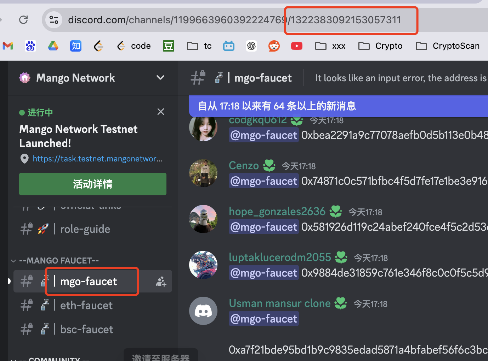
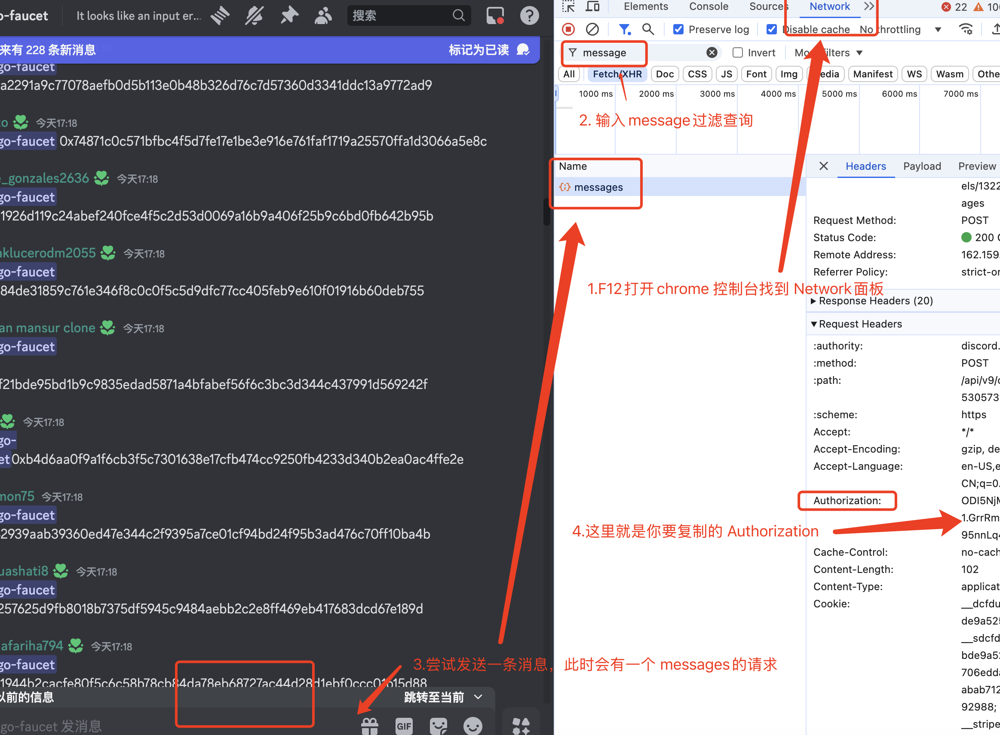

# dc-msg-bot

discord 自动发消息脚本

## 频道列表

将想要发自动送消息的频道 id 加入到上方 chanelList 里面

```js
// 频道id
const chanelList = ["第一个自动发送频道的id"， "第二个自动发送频道的id"];

```



## 配置 token

1.在 discord 想要自动发送消息的频道按照图片复制 Authorization


```js
// token list
const authorizationList = [
  "第一个帐号的Authorization",
  "第二个帐号的Authorization",
];
```

## 编辑发送内容

```js
const contextList [""]
```

## 定时发送

默认设置的 305s - 310s 间隔执行一次整个任务，可自行调整

```js
(async () => {
  let time = 1;
  while (true) {
    try {
      console.log("start:", time++, new Date().toLocaleString());
      await chat();
      // 305-310s 再发送下一次消息
      const sleep = random.int(305000, 310000);
      await sleep(sleep);
    } catch (error) {
      console.error(error);
    }
  }
})();
```

## 多个频道间隔，默认 30-50s 发送一个频道的消息

```js
// channel delay 30 - 50s
await sleep(random.int(30000, 50000));
```

## 一个帐号发送完后，默认 5-10s 发送下一个帐号的消息

```js
// account delay 5 - 10s
await sleep(random.int(5000, 10000));
```

## 整体时间线

帐号 1 => 发送完所有 channel list => 帐号 2 => 发送完所有 channel list =>...
